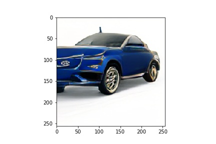

# CM3: A Causal Masked Multimodal Model of the Internet
This following document describes and explains the official code for the [CM3 paper](https://arxiv.org/abs/2201.07520).

First download the models and tokenizers with your favorite command (i.e., `wget`).
| Description      | Url |
| ----------- | ----------- |
| 13B Model Weights      | https://dl.fbaipublicfiles.com/cm3/model_13B.pt       |
| Dictionary Vocab   | https://dl.fbaipublicfiles.com/cm3/dict.txt        |
| Dictionary Model   |  https://dl.fbaipublicfiles.com/cm3/dict.model        |

## Loading CM3 Model

```py
import fairseq
from fairseq.models.transformer_lm import TransformerLanguageModel
custom_lm = TransformerLanguageModel.from_pretrained('download_folder/', 
                                                     'model_13B.pt', 
                                                      bpe='sentencepiece', 
                                                      tokenizer=None, 
                                                      sentencepiece_model='dict.model')

```
## Running Sampling
Once you've loaded up the model, try out all the prompts we mention in the paper! As a sample let's do zero-shot text-to-image generation. 

```py
custom_lm.sample('= 256:
        return ar[:256]
    return ar + ar[-(256-len(ar)):]

arr = pad_split("977 789 803 789 823 35 578 35 591 823 789 591 789 789 789 789 591 31 977 977 35 579 985 193 789 789 304 35 977 977 977 591 591 436 653 94 407 783 729 618 269 1022 707 350 31 35 977 591 35 591 304 966 854 794 220 143 83 110 517 297 922 283 193 35 329 494 494 32 230 453 32 40 166 707 520 729 985 184 136 591 426 556 797 887 426 82 892 82 849 166 426 82 329 1002 40 31 1018 447 404 58 210 334 402 503 685 92 426 990 856 894 438 406 945 552 210 918 82 742 206 189 6 685 601 595 63 334 6 505 426 965 985 128 164 164 996 215 80 784 82 402 120 992 906 789 210 780 508 457 373 599 698 345 438 425 729 417 37 597 945 628 299 295 301 887 132 345 96 382 961 433 610 614 977 578 185 789 982 176 418 719 460 483 586 746 774 628 578 1012 354 562 591 977 790 790 790 117 283 773 578 219 467 406 823 823 591 977 977 591 35 499 1012 742 1012 712 773 562 591 591 977 977 977 977 977 591 185 1012 899 562 562 591 977 977 977 977 977 977 977 977 977 591 977 823 591 591 591 591 591 591 591 591 591 591 591 591 591 591".split())
hard_recons = vae.decode(torch.tensor([int(x) for x in arr]).unsqueeze(0))
plt.imshow(hard_recons.detach().squeeze().permute(1,2,0), interpolation='nearest')
plt.show()
```

This should give you an image that looks something like this:


## Causal Masked Objective
One of the core novelties of the CM3 paper is the causal masked objective which slightly augments the standard language modeling objective to allow for optional generation on bidirectional context.

We implement the task in under the `causal_masked_language_modeling` fairseq task. The following section will describe how to train the causal masked objective on a standard wikitext language modeling task. We will follow the language_modeling tutorial in fairseq.
### 1) Preprocess the data

First download and prepare the [WikiText-103 dataset](https://www.salesforce.com/products/einstein/ai-research/the-wikitext-dependency-language-modeling-dataset/):

```bash
cd examples/language_model/
bash prepare-wikitext-103.sh
cd ../..
```

Next preprocess/binarize the data:
```bash
TEXT=examples/language_model/wikitext-103
fairseq-preprocess \
    --only-source \
    --trainpref $TEXT/wiki.train.tokens \
    --validpref $TEXT/wiki.valid.tokens \
    --testpref $TEXT/wiki.test.tokens \
    --destdir data-bin/wikitext-103 \
    --workers 20
```

### 2) Train a language model

Next we'll train a basic transformer language model on wikitext-103. Unlike standard LM we have to change the criterion to weighted_cross_entropy. This specific objective insures that we do not backpropagate through the sentinel tokens in the target output.

To train a basic LM (assumes 2 GPUs):
```
$ fairseq-train --task causal_masked_language_modeling \
  data-bin/wikitext-103 \
  --save-dir checkpoints/transformer_wikitext-103 \
  --arch transformer_lm --share-decoder-input-output-embed \
  --sentinel-method poisson --criterion weighted_cross_entropy
  --dropout 0.1 \
  --optimizer adam --adam-betas '(0.9, 0.98)' --weight-decay 0.01 --clip-norm 0.0 \
  --lr 0.0005 --lr-scheduler inverse_sqrt --warmup-updates 4000 --warmup-init-lr 1e-07 \
  --tokens-per-sample 512 --sample-break-mode none \
  --max-tokens 2048 --update-freq 16 \
  --fp16 \
  --max-update 50000
```